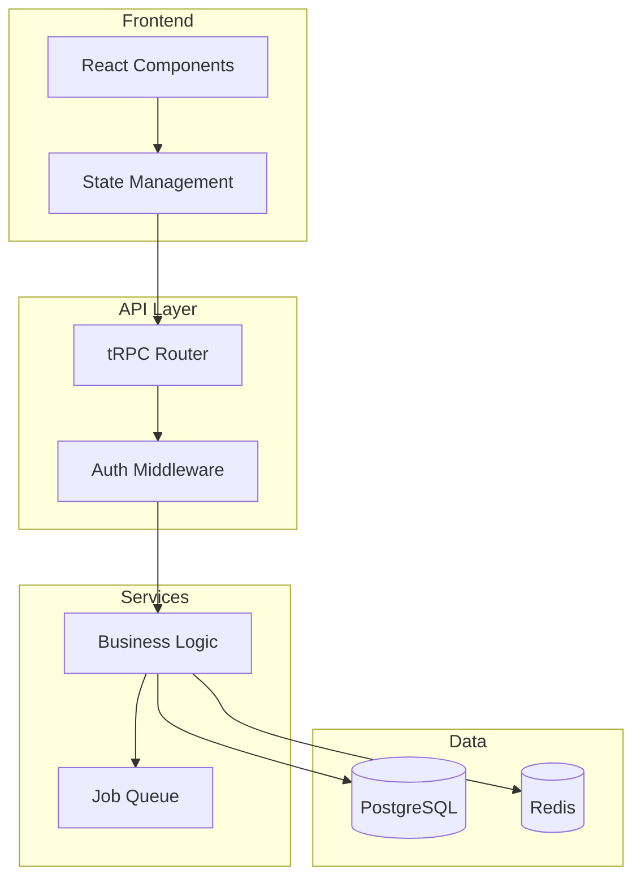
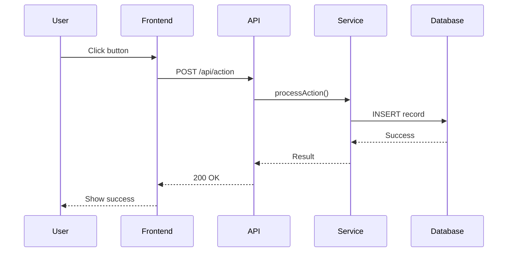
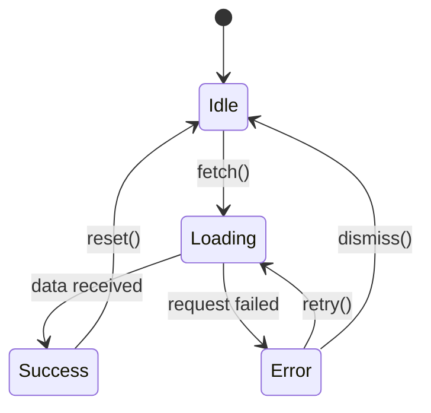
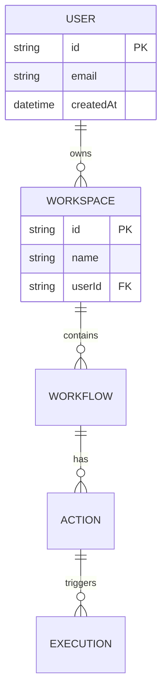
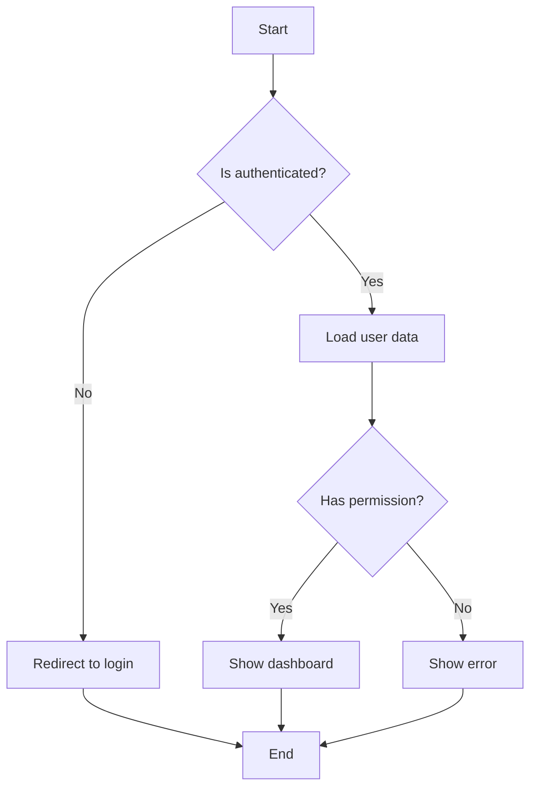
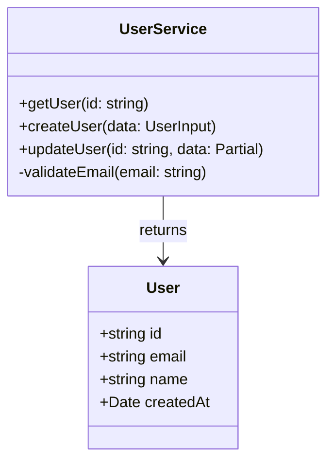

# Enhanced Plans

Create comprehensive implementation plans that include visual diagrams, code examples, and detailed technical explanations.

## When to Use

- Planning complex features or refactors
- Architecture decision records (ADRs)
- Technical design documents
- Explaining proposed changes before implementation
- When "plan mode" needs more visual depth

## Plan Structure

Every enhanced plan should include:

### 1. Executive Summary
Brief overview of what's being planned and why.

### 2. Architecture Diagram (Mermaid)
Visual representation of the system/feature.

### 3. Data Flow Diagram
How data moves through the system.

### 4. Implementation Steps
Detailed steps with code examples.

### 5. Risk Assessment
What could go wrong and mitigations.

### 6. Testing Strategy
How to verify the implementation.

## Mermaid Diagram Templates

### System Architecture


### Sequence Diagram


### State Machine


### Entity Relationship


### Flowchart


### Class Diagram


## Code Example Templates

### Before/After Comparison
```typescript
// BEFORE: Current implementation
const oldWay = () => {
  // problems with this approach...
};

// AFTER: Proposed implementation
const newWay = () => {
  // benefits of this approach...
};
```

### Interface Definition
```typescript
// New types this feature introduces
interface FeatureInput {
  // input shape
}

interface FeatureOutput {
  // output shape
}

// Usage example
const example: FeatureInput = {
  // concrete values
};
```

### Service Pattern
```typescript
// Effect-TS service pattern
export class NewFeatureService extends Effect.Service<NewFeatureService>()(
  "NewFeatureService",
  {
    effect: Effect.gen(function* () {
      const deps = yield* Dependencies;

      return {
        methodName: (input: Input) => Effect.gen(function* () {
          // implementation
        }),
      };
    }),
    dependencies: [DependencyLayer],
  }
) {}
```

## Plan Document Template

```markdown
# Feature: [Name]

## Summary
[1-2 sentences describing the feature]

## Motivation
- Why is this needed?
- What problem does it solve?
- What's the business value?

## Architecture

### System Context
[Mermaid graph showing where this fits]

### Data Flow
[Mermaid sequence diagram]

### New Components
[List of new files/modules]

## Implementation Plan

### Phase 1: [Name]
**Files to modify:**
- `path/to/file.ts` - [what changes]

**Code changes:**
[Code examples]

### Phase 2: [Name]
...

## Database Changes

### New Tables/Columns
[ERD diagram if applicable]

### Migrations
[Migration script or Prisma schema changes]

## API Changes

### New Endpoints
| Method | Path | Description |
|--------|------|-------------|
| POST | /api/feature | Creates new feature |

### Request/Response
[TypeScript interfaces]

## Testing Strategy

### Unit Tests
- [ ] Test case 1
- [ ] Test case 2

### Integration Tests
- [ ] Test case 1

### E2E Tests
- [ ] User flow test

## Risks & Mitigations

| Risk | Impact | Mitigation |
|------|--------|------------|
| [Risk 1] | High | [Mitigation] |

## Open Questions
- [ ] Question 1?
- [ ] Question 2?

## Timeline Estimate
[Optional: rough complexity indicator]
```

## Output Location

Write enhanced plans to:
- `.claude/plans/[feature-name].md` for permanent plans
- Include in conversation for ad-hoc planning

## Tips

1. **Start with the diagram** - it forces you to think about structure
2. **Show data flow** - most bugs live in data transformations
3. **Include error cases** - happy path is only half the story
4. **Reference existing code** - show where new code integrates
5. **Keep code examples small** - illustrative, not exhaustive
