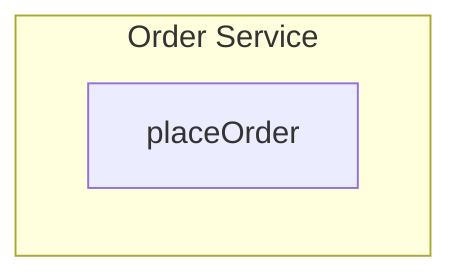
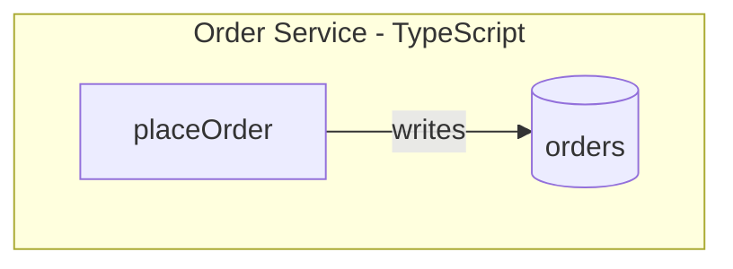
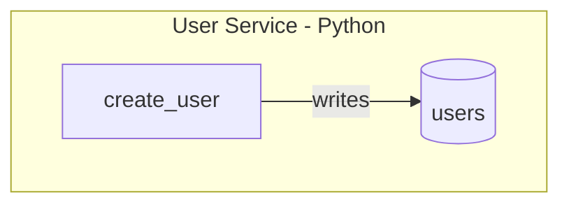
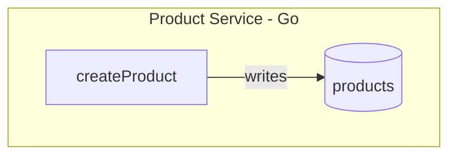
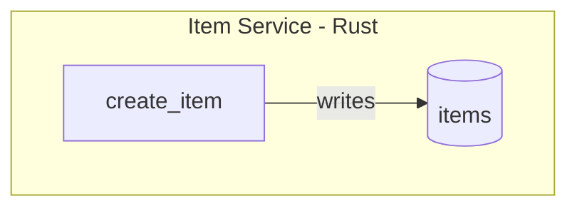
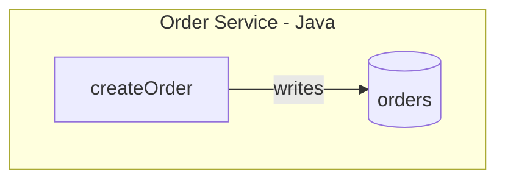
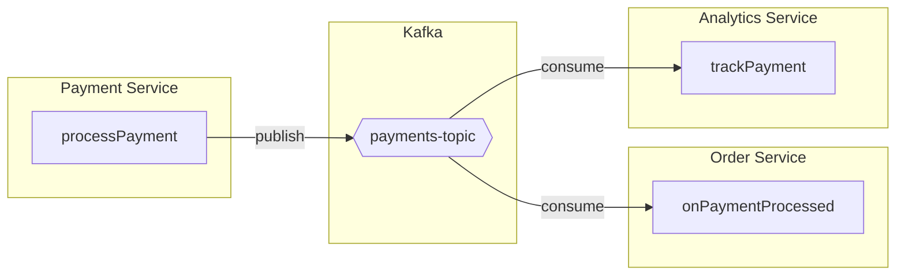

# Contract Graph Generation Skill

A Claude Code skill that automatically generates contract definitions by analyzing your codebase and interviewing you about invisible dependencies.

## Table of Contents

- [Overview](#overview)
- [Installation](#installation)
- [Quick Start](#quick-start)
- [How It Works](#how-it-works)
- [Output Format](#output-format)
- [Supported Frameworks](#supported-frameworks)
- [Contract Annotations](#contract-annotations)
- [Code Annotations](#code-annotations)
- [Interview Process](#interview-process)
- [Examples](#examples)
- [Integration with contract-graph CLI](#integration-with-contract-graph-cli)
- [Troubleshooting](#troubleshooting)

## Overview

**Problem:** AI agents and developers need to understand system contracts—the implicit agreements between components about what they expose, consume, and guarantee. However, many contracts are "invisible":

- Cross-repository event consumers
- External API callers
- Shared database tables
- Business invariants in developers' heads

**Solution:** This skill combines automated static analysis with targeted user interviews to generate comprehensive contract documentation in Mermaid diagram format with rich annotations.

### What You Get



## Installation

The skill is installed as a global Claude Code skill:

```
~/.claude/skills/contract-graph/
├── SKILL.md                    # Main skill definition
├── README.md                   # This file
└── references/
    ├── discovery-patterns.md   # Framework-specific discovery patterns
    └── interview-questions.md  # Interview question templates
```

No additional installation required—just invoke it in any Claude Code session.

## Quick Start

1. Navigate to your project directory
2. Run the skill:
   ```
   /contract-graph
   ```
3. Answer interview questions about external dependencies
4. Review generated contracts in `contracts/system.md`

## How It Works

The skill operates in four phases:

### Phase 1: Codebase Discovery

Automatically scans your codebase for:

| Discovery Type | What's Found |
|---------------|--------------|
| **API Endpoints** | Express, Fastify, tRPC, Next.js routes, Hono |
| **Database Operations** | Drizzle, Prisma, TypeORM, raw SQL |
| **Events** | Custom event buses, Kafka, Redis, Inngest |
| **External Calls** | fetch, axios, SDK clients (Stripe, Twilio, etc.) |

Example discovery output:

```
## Discovery Summary

### API Endpoints Found
| Endpoint | File:Line | Method |
|----------|-----------|--------|
| POST /api/orders | src/routes/orders.ts:23 | createOrder |
| GET /api/users/:id | src/routes/users.ts:45 | getUser |

### Database Operations Found
| Table | Operation | File:Line |
|-------|-----------|-----------|
| orders | INSERT | src/services/order.ts:78 |
| users | SELECT | src/services/user.ts:34 |

### Events Found
| Event Name | Type | File:Line |
|------------|------|-----------|
| OrderPlaced | publish | src/orders/handler.ts:92 |
| PaymentReceived | consume | src/payments/listener.ts:15 |
```

### Phase 2: User Interview

For each discovered component, the skill asks targeted questions about things static analysis cannot detect:

**External Triggers:**
> "I found this endpoint: POST /api/orders. Is this called by only this codebase, another service, or external clients?"

**Event Consumers:**
> "This function publishes an OrderPlaced event. Does anything OUTSIDE this repo consume this event?"

**Database Sharing:**
> "The 'orders' table is written here. Is this table read by other services?"

**Business Invariants:**
> "For OrderService.placeOrder, what business rules must ALWAYS be true?"

### Phase 3: Contract Generation

Generates Mermaid diagrams with comprehensive annotations:

```markdown
## Order Service Contracts

​```mermaid
graph TB
    subgraph OrderService[Order Service]
        %% @contract OrderService.placeOrder
        %% @location src/orders/handlers/place.ts:45
        %% @exposes POST /api/orders
        %% @schema {"input": "PlaceOrderDTO", "output": "Order"}
        %% @invariant order total must be positive
        %% @invariant user must exist and be verified
        %% @error ValidationError, UserNotFoundError
        %% @publishes OrderPlaced
        %% @writes orders, order_items
        placeOrder[placeOrder]

        %% @contract DB.orders
        %% @schema {"table": "orders", "pk": "id"}
        orders[(orders)]

        placeOrder -->|"writes"| orders
    end

    %% Cross-service event flow
    %% @repo github.com/org/notification-service
    %% @consumes OrderPlaced
    NotificationService[Notification Service]

    OrderService -->|"publishes: OrderPlaced"| NotificationService
​```
```

### Phase 4: Validation

If the `contract-graph` CLI is available:
```bash
npx contract-graph validate contracts/
```

Otherwise, performs manual validation:
- Verifies Mermaid syntax is valid
- Checks `@location` annotations point to existing files
- Validates annotation format

## Output Format

### Directory Structure

```
your-project/
├── contracts/
│   └── system.md          # Generated contract definitions
├── src/
│   └── ...
└── ...
```

### Contract File Structure

```markdown
# System Contracts

Generated by contract-graph skill on 2024-01-25

## System Overview

[High-level Mermaid diagram showing all services]

## Service: OrderService

[Detailed contracts for OrderService]

## Service: UserService

[Detailed contracts for UserService]

## Cross-Service Dependencies

[Event flows and cross-repo relationships]
```

## Supported Languages & Frameworks

**This skill is technology-agnostic.** It supports multiple programming languages and automatically adapts based on detected technology.

### Language Detection

The skill first detects your technology stack by checking for:

| Config File | Language | Typical Frameworks |
|-------------|----------|-------------------|
| `package.json` | JavaScript/TypeScript | Express, Fastify, Next.js, tRPC |
| `go.mod` | Go | Gin, Echo, Chi, net/http |
| `Cargo.toml` | Rust | Actix-web, Axum, Rocket |
| `requirements.txt`/`pyproject.toml` | Python | Flask, FastAPI, Django |
| `Gemfile` | Ruby | Rails, Sinatra |
| `pom.xml`/`build.gradle` | Java | Spring Boot, Quarkus |
| `*.csproj` | C# | ASP.NET Core |

### Supported Frameworks by Language

#### TypeScript/JavaScript
| Category | Frameworks |
|----------|-----------|
| **API** | Express, Fastify, tRPC, Next.js, Hono, NestJS |
| **Database** | Drizzle, Prisma, TypeORM, raw SQL |
| **Events** | Custom EventBus, Kafka, Redis, Inngest |

#### Python
| Category | Frameworks |
|----------|-----------|
| **API** | Flask, FastAPI, Django, Starlette |
| **Database** | SQLAlchemy, Django ORM, Tortoise |
| **Events** | Celery, RabbitMQ, Kafka |

#### Go
| Category | Frameworks |
|----------|-----------|
| **API** | Gin, Echo, Chi, Fiber, net/http |
| **Database** | GORM, sqlx, database/sql, Ent |
| **Events** | NATS, Kafka, Redis |

#### Rust
| Category | Frameworks |
|----------|-----------|
| **API** | Actix-web, Axum, Rocket, Warp |
| **Database** | Diesel, SQLx, SeaORM |
| **Events** | Tokio channels, Kafka, NATS |

#### Java
| Category | Frameworks |
|----------|-----------|
| **API** | Spring Boot, Quarkus, Micronaut |
| **Database** | JPA/Hibernate, JDBC, jOOQ |
| **Events** | Spring Events, Kafka, RabbitMQ |

#### Ruby
| Category | Frameworks |
|----------|-----------|
| **API** | Rails, Sinatra, Hanami |
| **Database** | ActiveRecord, Sequel |
| **Events** | Sidekiq, Kafka, RabbitMQ |

#### C#
| Category | Frameworks |
|----------|-----------|
| **API** | ASP.NET Core, Minimal APIs |
| **Database** | Entity Framework, Dapper |
| **Events** | MassTransit, Azure Service Bus |

### Universal Patterns

Even for unsupported frameworks, the skill can detect:
- **SQL statements** (SELECT, INSERT, UPDATE, DELETE)
- **HTTP URLs** (https://, http://)
- **Event keywords** (publish, subscribe, emit, consume)

### Fallback: Interview-Driven Discovery

If automatic detection fails, the skill will interview you about your contracts:
- What HTTP endpoints exist?
- What events are published/consumed?
- What databases/tables are accessed?
- What external services are called?

## Contract Annotations

The skill generates contracts with these annotations:

| Annotation | Purpose | Example |
|------------|---------|---------|
| `@contract` | Unique contract identifier | `@contract UserService.createUser` |
| `@location` | Exact source code location | `@location src/services/user.ts:23` |
| `@exposes` | HTTP endpoint exposed | `@exposes POST /api/users` |
| `@schema` | Input/output types | `@schema {"input": "CreateUserDTO", "output": "User"}` |
| `@invariant` | Business rules that must hold | `@invariant email must be unique` |
| `@error` | Errors callers must handle | `@error UserNotFound, ValidationError` |
| `@publishes` | Events this contract emits | `@publishes UserCreated` |
| `@consumes` | Events this contract handles | `@consumes OrderPlaced` |
| `@reads` | Database tables read | `@reads users, profiles` |
| `@writes` | Database tables written | `@writes users` |
| `@calls` | External services called | `@calls PaymentGateway.charge` |
| `@queue` | Message queue used | `@queue order-events` |
| `@repo` | Cross-repo dependency | `@repo github.com/org/other-service` |
| `@version` | Contract version | `@version 1.0.0` |

## Code Annotations

The skill automatically injects minimal `@contract` annotations into your source files, linking code to its contract definition. This means AI agents see contract context immediately when reading functions.

### What Gets Injected

When a contract has a `@location` annotation pointing to source code, the skill adds a JSDoc annotation:

**For functions without existing JSDoc:**
```typescript
/**
 * @contract conversation.create
 * @see contracts/system.md#conversation.create
 */
create: protectedProcedure
  .input(z.object({ sourceFile: z.string() }))
  .mutation(async ({ ctx, input }) => { ... })
```

**For functions with existing JSDoc (preserves description):**
```typescript
/**
 * Create a new conversation for a source file
 *
 * @contract conversation.create
 * @see contracts/system.md#conversation.create
 */
create: protectedProcedure...
```

### Benefits

- **Immediate context** - Agents see contract info when reading code, no cross-referencing needed
- **IDE integration** - VS Code shows contract info on hover via JSDoc
- **Self-documenting** - Codebase explains its own contracts
- **Reduced errors** - Agents are less likely to violate invariants they can see

### Programmatic Usage

```typescript
import { annotateSourceFiles, formatAnnotationResults } from '@clive/contract-graph';

// Inject annotations into all source files with @location
const results = await annotateSourceFiles(graph, {
  contractsFile: 'contracts/system.md',  // Path for @see links
  dryRun: false,                         // Set true to preview changes
  baseDir: process.cwd()
});

// Display results
console.log(formatAnnotationResults(results));
// Output:
// Code annotations injected:
// - packages/api/src/router/conversation.ts:17 - conversation.create (added)
// - packages/api/src/router/conversation.ts:41 - conversation.getById (added)
// - packages/db/src/schema.ts:36 - DB.user (skipped - already annotated)
//
// Summary: 15 added, 2 updated, 3 skipped
```

### Manual Annotation

You can also add annotations manually following this format:

```typescript
/**
 * @contract {contractId}
 * @see contracts/system.md#{contractId}
 */
```

The `@contract` tag links to the contract definition, and `@see` provides a direct link to the contract section in the markdown file.

## Interview Process

The skill asks questions using Claude Code's `AskUserQuestion` tool. Here's what to expect:

### Question Types

**1. Service Boundaries**
```
I found the following modules in your codebase:
- /src/orders (12 files)
- /src/users (8 files)
- /src/payments (5 files)

Do these represent:
○ Separate deployable services
○ Modules within a monolith
○ Mix (please specify)
```

**2. External Callers**
```
I found this endpoint: POST /api/orders

Who calls this endpoint?
○ Only this codebase
○ Another internal service
○ External clients - mobile app
○ External clients - third party
○ Public API
```

**3. Event Consumers**
```
This code publishes an OrderPlaced event.
Location: src/orders/handler.ts:78

Who consumes this event?
○ Only consumers in this repo
○ Consumers in other repositories
○ External systems (webhooks)
○ Unknown
```

**4. Database Sharing**
```
The 'orders' table is written to in this codebase.

Is this table read by other services?
○ No, only this service
○ Yes, other services read directly
○ Yes, via an API
○ Unknown
```

**5. Business Invariants**
```
For OrderService.placeOrder:

What business rules must ALWAYS be true?
[Free text input for listing invariants]
```

### Tips for Answering

1. **Be specific** - "Another service" → specify which repo/service
2. **List all invariants** - Even obvious ones are valuable for AI agents
3. **Note uncertainty** - "Unknown" is a valid answer; it gets documented
4. **Think about edge cases** - What error conditions exist?

## Examples

### Example 1: TypeScript E-commerce Service

**Input:** A typical TypeScript e-commerce codebase.

**Discovery finds:**
- `POST /api/orders` endpoint (Express)
- `orders` table (Drizzle ORM)
- `OrderPlaced` event publisher
- Stripe API calls

**Generated contract:**



### Example 2: Python FastAPI Service

**Input:** A Python FastAPI codebase with SQLAlchemy.

**Discovery finds:**
- `@app.post("/api/users")` endpoint
- SQLAlchemy models and queries
- Celery task definitions

**Code detected:**
```python
@app.post("/api/users")
async def create_user(user: UserCreate) -> User:
    db_user = User(**user.dict())
    session.add(db_user)
    session.commit()
    send_welcome_email.delay(user.email)
    return db_user
```

**Generated contract:**



### Example 3: Go Gin Service

**Input:** A Go service using Gin and GORM.

**Discovery finds:**
- `r.POST("/api/products", createProduct)`
- GORM database operations
- NATS event publishing

**Code detected:**
```go
r.POST("/api/products", createProduct)
r.GET("/api/products/:id", getProduct)

func createProduct(c *gin.Context) {
    db.Create(&product)
    nats.Publish("product.created", data)
}
```

**Generated contract:**



### Example 4: Rust Axum Service

**Input:** A Rust service using Axum and SQLx.

**Discovery finds:**
- `Router::new().route("/api/items", post(create_item))`
- SQLx database queries
- Tokio channel events

**Code detected:**
```rust
let app = Router::new()
    .route("/api/items", post(create_item))
    .route("/api/items/:id", get(get_item));

async fn create_item(Json(item): Json<CreateItem>) -> impl IntoResponse {
    sqlx::query!("INSERT INTO items (name) VALUES ($1)", item.name)
        .execute(&pool)
        .await?;
}
```

**Generated contract:**



### Example 5: Java Spring Boot Service

**Input:** A Java service using Spring Boot and JPA.

**Discovery finds:**
- `@PostMapping("/api/orders")` annotations
- JPA Repository operations
- Spring Event publishing

**Code detected:**
```java
@PostMapping("/api/orders")
public Order createOrder(@RequestBody CreateOrderDto dto) {
    Order order = orderRepository.save(new Order(dto));
    eventPublisher.publishEvent(new OrderCreatedEvent(order));
    return order;
}
```

**Generated contract:**



### Example 6: Microservices with Kafka (Language Agnostic)

**Discovery finds:**
- Multiple Kafka producers/consumers across different languages
- Shared event schema

**Generated contract (annotations are language-agnostic):**



## Integration with contract-graph CLI

This skill generates contracts compatible with the `@clive/contract-graph` package.

### Validation

```bash
# Validate generated contracts (from project root)
npx @clive/contract-graph validate contracts/

# Query contracts
npx @clive/contract-graph query "what calls OrderService?"

# Analyze impact
npx @clive/contract-graph impact OrderService.placeOrder

# Generate documentation (IMPORTANT: use --dir . from project root)
npx @clive/contract-graph docs --dir . --output docs/contracts.md

# Generate AI-optimized format for agents
npx @clive/contract-graph docs --dir . --claude --output contracts/CONTRACTS-AI.md
```

### Using Contracts with AI Agents

The generated contracts are designed for AI agent consumption. There are two ways agents can access contract information:

#### Option 1: Read the AI-Optimized Contract File

The skill generates `contracts/CONTRACTS-AI.md` which is optimized for AI consumption. Add this to your CLAUDE.md or agent context:

```markdown
<!-- In CLAUDE.md -->
## System Contracts

When editing files, review the contract definitions in `contracts/CONTRACTS-AI.md`.
This file contains invariants, schemas, and cross-service dependencies you must maintain.
```

#### Option 2: Programmatic Access via QueryEngine

For agents that need to query contracts dynamically:

```typescript
import { loadContracts, QueryEngine } from '@clive/contract-graph';

// Load all contracts from the project
const { graph, errors } = await loadContracts('.');
const engine = new QueryEngine(graph);

// Query 1: Get contracts for a file you're about to edit
const result = engine.contractsFor('src/services/order.ts');
console.log('Invariants to maintain:', result.invariants);
console.log('Errors to handle:', result.errors);
console.log('Dependents:', result.dependents.map(c => c.id));

// Query 2: Analyze impact before making changes
const impact = engine.impactOf('OrderService.placeOrder');
if (impact) {
  console.log('Warnings:', impact.warnings);
  console.log('Cross-repo impacts:', [...impact.crossRepoImpacts.keys()]);
  console.log('Invariants to maintain:', impact.invariantsToMaintain);
}

// Query 3: Find all consumers of an event
const consumers = graph.findConsumers('OrderPlaced');
console.log('Event consumers:', consumers.map(c => `${c.id} @ ${c.location?.file}`));

// Query 4: Get a summary of the system
const summary = engine.summary();
console.log(`Total contracts: ${summary.totalContracts}`);
console.log(`With invariants: ${summary.contractsWithInvariants}`);
console.log(`Cross-repo relationships: ${summary.crossRepoRelationships}`);
```

#### Option 3: CLI Queries for Ad-hoc Analysis

Agents can shell out to the CLI for quick queries:

```bash
# What contracts affect a specific file?
npx @clive/contract-graph query "contracts for src/orders/handler.ts"

# What's the impact of changing a contract?
npx @clive/contract-graph impact OrderService.placeOrder

# List all contracts with invariants
npx @clive/contract-graph query "contracts with invariants"
```

### Keeping Contracts Updated

After making code changes that affect contracts, regenerate the AI docs:

```bash
npx @clive/contract-graph docs --dir . --claude --output contracts/CONTRACTS-AI.md
```

Or run the skill again to capture new contracts:

```
/contract-graph
```

## Troubleshooting

### Skill not found

Ensure the skill is installed at `~/.claude/skills/contract-graph/SKILL.md`

### Discovery missing patterns

The skill may not recognize custom frameworks. Check `references/discovery-patterns.md` for supported patterns. You can:

1. Manually add discovered endpoints during the interview
2. Extend discovery patterns in the reference file

### Interview questions not appearing

The skill uses `AskUserQuestion` which requires interactive mode. Ensure you're running Claude Code interactively.

### Generated Mermaid not rendering

1. Check for syntax errors in the generated file
2. Ensure code blocks use ` ```mermaid ` fence
3. Try rendering in a Mermaid-compatible viewer

### Validation failures

Common issues:
- `@location` points to moved/deleted file → Update the path
- Missing required annotation → Add the annotation
- Invalid JSON in `@schema` → Fix JSON syntax

## Contributing

To improve this skill:

1. **Add discovery patterns** - Edit `references/discovery-patterns.md`
2. **Add interview questions** - Edit `references/interview-questions.md`
3. **Improve the workflow** - Edit `SKILL.md`

## License

Part of the Clive project. See the main repository for license information.
