# Clive System Contracts

Generated by contract-graph skill on 2026-01-25

## System Overview

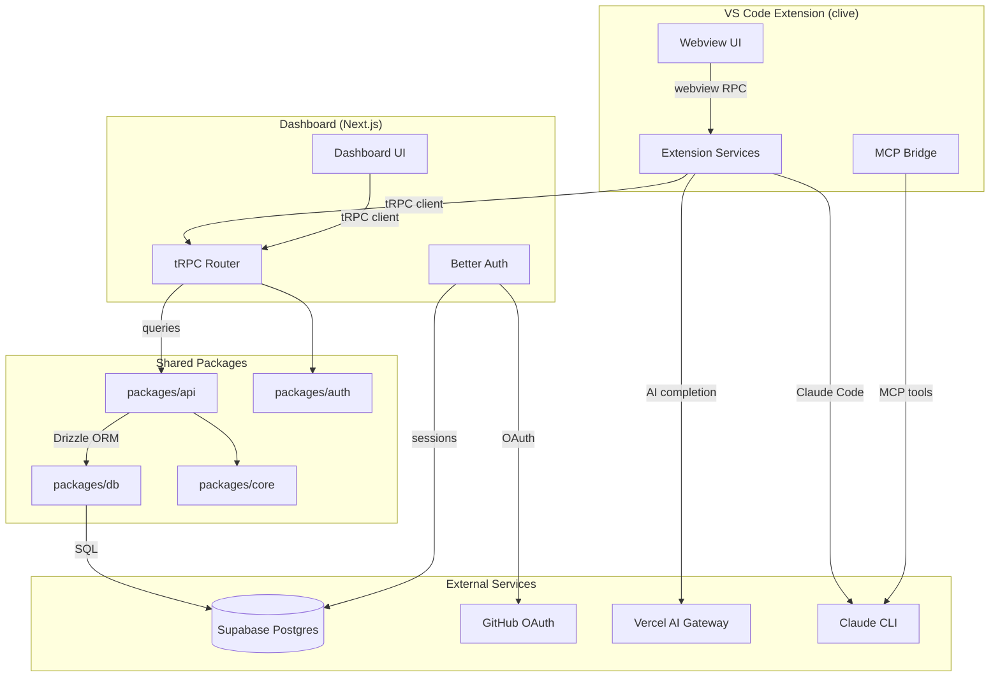

## Service Deployments

| Service | Type | Repository |
|---------|------|------------|
| VS Code Extension | VS Code Extension | apps/extension |
| Dashboard | Next.js App | apps/dashboard |
| Database | Supabase Postgres | External |

---

## Database Contracts

### Tables Overview

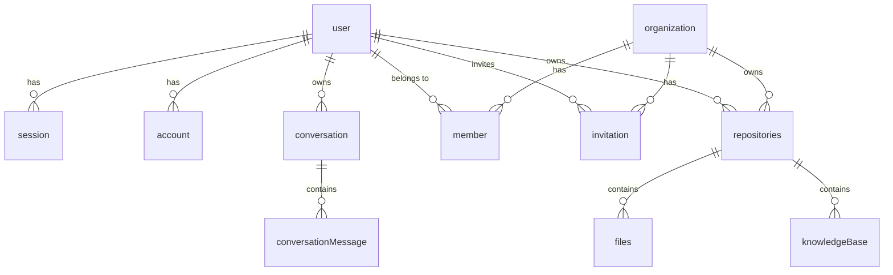

### User Table Contract

```mermaid
graph LR
    %% @contract DB.user
    %% @location packages/db/src/schema.ts:36
    %% @schema {"table": "user", "pk": "id"}
    %% @invariant email must be unique across the system
    %% @invariant id is the primary key (text)
    %% @reads auth (Better Auth), conversation queries, repository queries
    %% @writes auth (Better Auth registration/updates)
    user[(user)]
```

| Column | Type | Constraints | Notes |
|--------|------|-------------|-------|
| id | text | PK | Primary key |
| name | text | NOT NULL | Display name |
| email | text | NOT NULL, UNIQUE | User's email |
| emailVerified | boolean | DEFAULT false | Email verification status |
| image | text | NULLABLE | Profile image URL |
| createdAt | timestamp | DEFAULT NOW() | Creation timestamp |
| updatedAt | timestamp | ON UPDATE NOW() | Last update timestamp |

### Session Table Contract

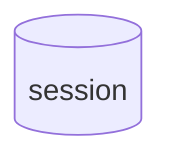

### Account Table Contract

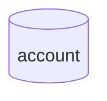

### Organization Table Contract

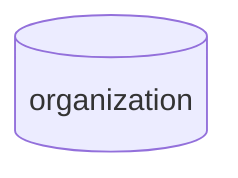

### Member Table Contract

```mermaid
graph LR
    %% @contract DB.member
    %% @location packages/db/src/schema.ts:118
    %% @schema {"table": "member", "pk": "id", "fk": {"organizationId": "organization.id", "userId": "user.id"}}
    %% @invariant users must be members to access organization resources
    %% @reads organization membership checks
    %% @writes organization member management
    member[(member)]
```

### Conversation Table Contract

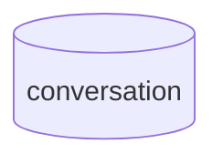

| Column | Type | Constraints | Notes |
|--------|------|-------------|-------|
| id | text | PK | Primary key |
| userId | text | FK -> user.id | Owner of conversation |
| sourceFile | text | NULLABLE | Deprecated: kept for backward compatibility |
| branchName | text | NULLABLE | Git branch name |
| baseBranch | text | DEFAULT 'main' | Base branch for comparison |
| sourceFiles | text | NULLABLE | JSON array of file paths |
| conversationType | enum | NOT NULL, DEFAULT 'file' | 'branch', 'uncommitted', 'file' |
| commitHash | text | NULLABLE | HEAD commit hash for uncommitted conversations |
| status | enum | NOT NULL, DEFAULT 'planning' | 'planning', 'confirmed', 'completed' |
| createdAt | timestamp | DEFAULT NOW() | Creation timestamp |
| updatedAt | timestamp | ON UPDATE NOW() | Last update timestamp |

### Conversation Message Table Contract

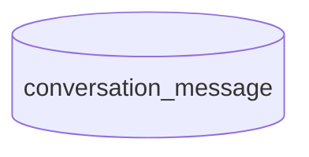

### Repositories Table Contract

```mermaid
graph LR
    %% @contract DB.repositories
    %% @location packages/db/src/schema.ts:225
    %% @schema {"table": "repositories", "pk": "id", "fk": {"userId": "user.id", "organizationId": "organization.id"}}
    %% @invariant users can only access their own or organization's repositories
    %% @reads repository queries
    %% @writes repository upsert operations
    repositories[(repositories)]
```

### Files Table Contract

```mermaid
graph LR
    %% @contract DB.files
    %% @location packages/db/src/schema.ts:243
    %% @schema {"table": "files", "pk": "id", "fk": {"repositoryId": "repositories.id"}}
    %% @invariant unique constraint on (repositoryId, relativePath)
    %% @reads file queries, semantic search
    %% @writes file upsert/delete operations
    %% @index HNSW on embedding for vector similarity search
    files[(files)]
```

### Knowledge Base Table Contract

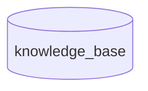

---

## tRPC API Contracts

### Repository Router

```mermaid
graph TB
    subgraph RepositoryRouter["repository Router"]
        %% @contract repository.upsert
        %% @location packages/api/src/router/repository.ts:14
        %% @exposes mutation repository.upsert
        %% @schema {"input": "{name: string, rootPath: string, organizationId?: string}", "output": "Repository"}
        %% @writes repositories
        %% @error RepositoryError -> INTERNAL_SERVER_ERROR
        upsert[repository.upsert]

        %% @contract repository.get
        %% @location packages/api/src/router/repository.ts:49
        %% @exposes query repository.get
        %% @schema {"input": "{rootPath: string, organizationId?: string}", "output": "Repository | null"}
        %% @reads repositories
        %% @error RepositoryError -> INTERNAL_SERVER_ERROR
        get[repository.get]

        %% @contract repository.getStatus
        %% @location packages/api/src/router/repository.ts:82
        %% @exposes query repository.getStatus
        %% @schema {"input": "{rootPath: string, organizationId?: string}", "output": "RepositoryStatus"}
        %% @reads repositories, files
        %% @error RepositoryError -> INTERNAL_SERVER_ERROR
        getStatus[repository.getStatus]

        %% @contract repository.upsertFile
        %% @location packages/api/src/router/repository.ts:115
        %% @exposes mutation repository.upsertFile
        %% @schema {"input": "{repositoryId: string, file: FileInput}", "output": "{success: boolean}"}
        %% @writes files
        %% @error RepositoryError -> INTERNAL_SERVER_ERROR
        upsertFile[repository.upsertFile]

        %% @contract repository.deleteFile
        %% @location packages/api/src/router/repository.ts:151
        %% @exposes mutation repository.deleteFile
        %% @schema {"input": "{repositoryId: string, relativePath: string}", "output": "{success: boolean}"}
        %% @writes files
        %% @error RepositoryError -> INTERNAL_SERVER_ERROR
        deleteFile[repository.deleteFile]

        %% @contract repository.deleteFiles
        %% @location packages/api/src/router/repository.ts:181
        %% @exposes mutation repository.deleteFiles
        %% @schema {"input": "{repositoryId: string, relativePaths: string[]}", "output": "{success: boolean, deletedCount: number}"}
        %% @writes files
        %% @error RepositoryError -> INTERNAL_SERVER_ERROR
        deleteFiles[repository.deleteFiles]

        %% @contract repository.getFileByPath
        %% @location packages/api/src/router/repository.ts:211
        %% @exposes query repository.getFileByPath
        %% @schema {"input": "{repositoryId: string, relativePath: string}", "output": "File | null"}
        %% @reads files
        %% @error RepositoryError -> INTERNAL_SERVER_ERROR
        getFileByPath[repository.getFileByPath]

        %% @contract repository.getFileHashes
        %% @location packages/api/src/router/repository.ts:243
        %% @exposes query repository.getFileHashes
        %% @schema {"input": "{repositoryId: string}", "output": "FileHash[]"}
        %% @reads files
        %% @error RepositoryError -> INTERNAL_SERVER_ERROR
        getFileHashes[repository.getFileHashes]

        %% @contract repository.searchFiles
        %% @location packages/api/src/router/repository.ts:271
        %% @exposes query repository.searchFiles
        %% @schema {"input": "{repositoryId: string, queryEmbedding: number[], limit?: number}", "output": "SearchResult[]"}
        %% @reads files
        %% @error RepositoryError -> INTERNAL_SERVER_ERROR
        searchFiles[repository.searchFiles]
    end
```

### Conversation Router

```mermaid
graph TB
    subgraph ConversationRouter["conversation Router"]
        %% @contract conversation.create
        %% @location packages/api/src/router/conversation.ts:17
        %% @exposes mutation conversation.create
        %% @schema {"input": "{sourceFile: string}", "output": "Conversation"}
        %% @writes conversation
        %% @error ConversationError -> INTERNAL_SERVER_ERROR
        create[conversation.create]

        %% @contract conversation.getById
        %% @location packages/api/src/router/conversation.ts:41
        %% @exposes query conversation.getById
        %% @schema {"input": "{id: string}", "output": "Conversation"}
        %% @invariant users can only access their own conversations
        %% @reads conversation
        %% @error ConversationNotFoundError -> NOT_FOUND
        %% @error ConversationError -> INTERNAL_SERVER_ERROR
        %% @error ownership violation -> FORBIDDEN
        getById[conversation.getById]

        %% @contract conversation.getByFile
        %% @location packages/api/src/router/conversation.ts:83
        %% @exposes query conversation.getByFile
        %% @schema {"input": "{sourceFile: string}", "output": "Conversation | null"}
        %% @reads conversation
        %% @error ConversationError -> INTERNAL_SERVER_ERROR
        getByFile[conversation.getByFile]

        %% @contract conversation.getByBranch
        %% @location packages/api/src/router/conversation.ts:107
        %% @exposes query conversation.getByBranch
        %% @schema {"input": "{branchName: string, baseBranch?: string, conversationType: 'branch' | 'uncommitted', commitHash?: string}", "output": "Conversation | null"}
        %% @reads conversation
        %% @error ConversationError -> INTERNAL_SERVER_ERROR
        getByBranch[conversation.getByBranch]

        %% @contract conversation.createForBranch
        %% @location packages/api/src/router/conversation.ts:144
        %% @exposes mutation conversation.createForBranch
        %% @schema {"input": "{branchName: string, baseBranch?: string, sourceFiles: string[], conversationType: 'branch' | 'uncommitted', commitHash?: string}", "output": "Conversation"}
        %% @writes conversation
        %% @error ConversationError -> INTERNAL_SERVER_ERROR
        createForBranch[conversation.createForBranch]

        %% @contract conversation.list
        %% @location packages/api/src/router/conversation.ts:183
        %% @exposes query conversation.list
        %% @schema {"input": "void", "output": "Conversation[]"}
        %% @reads conversation
        %% @error ConversationError -> INTERNAL_SERVER_ERROR
        list[conversation.list]

        %% @contract conversation.updateStatus
        %% @location packages/api/src/router/conversation.ts:205
        %% @exposes mutation conversation.updateStatus
        %% @schema {"input": "{id: string, status: 'planning' | 'confirmed' | 'completed'}", "output": "Conversation"}
        %% @invariant users can only update their own conversations
        %% @writes conversation
        %% @error ConversationNotFoundError -> NOT_FOUND
        %% @error ConversationError -> INTERNAL_SERVER_ERROR
        %% @error ownership violation -> FORBIDDEN
        updateStatus[conversation.updateStatus]

        %% @contract conversation.delete
        %% @location packages/api/src/router/conversation.ts:275
        %% @exposes mutation conversation.delete
        %% @schema {"input": "{id: string}", "output": "{success: boolean}"}
        %% @invariant users can only delete their own conversations
        %% @writes conversation
        %% @error ConversationNotFoundError -> NOT_FOUND
        %% @error ConversationError -> INTERNAL_SERVER_ERROR
        %% @error ownership violation -> FORBIDDEN
        delete[conversation.delete]

        %% @contract conversation.addMessage
        %% @location packages/api/src/router/conversation.ts:334
        %% @exposes mutation conversation.addMessage
        %% @schema {"input": "{conversationId: string, role: 'user' | 'assistant' | 'system', content: string, toolCalls?: unknown}", "output": "Message"}
        %% @invariant users can only add messages to their own conversations
        %% @writes conversationMessage
        %% @error ConversationNotFoundError -> NOT_FOUND
        %% @error MessageError -> INTERNAL_SERVER_ERROR
        %% @error ownership violation -> FORBIDDEN
        addMessage[conversation.addMessage]

        %% @contract conversation.getMessages
        %% @location packages/api/src/router/conversation.ts:403
        %% @exposes query conversation.getMessages
        %% @schema {"input": "{conversationId: string}", "output": "Message[]"}
        %% @invariant users can only read messages from their own conversations
        %% @reads conversationMessage
        %% @error ConversationNotFoundError -> NOT_FOUND
        %% @error MessageError -> INTERNAL_SERVER_ERROR
        %% @error ownership violation -> FORBIDDEN
        getMessages[conversation.getMessages]
    end
```

### Auth Router

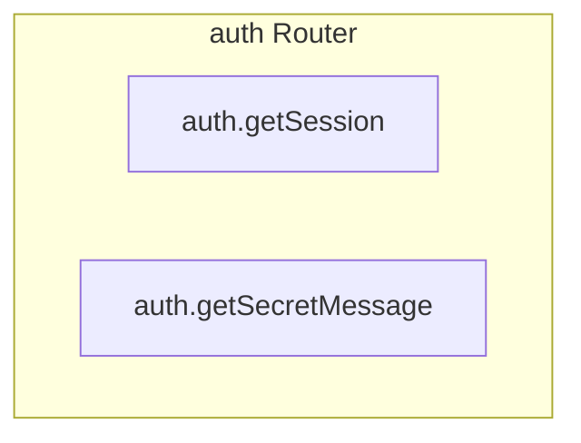

---

## External Service Contracts

### Better Auth (Authentication)

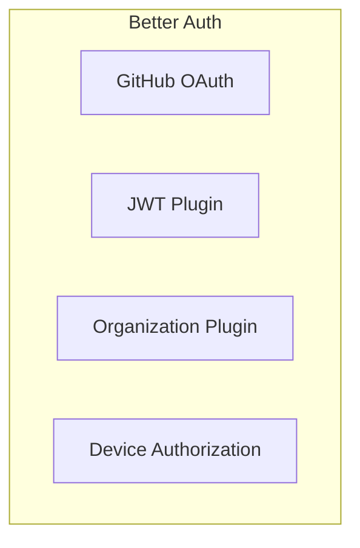

### Vercel AI Gateway

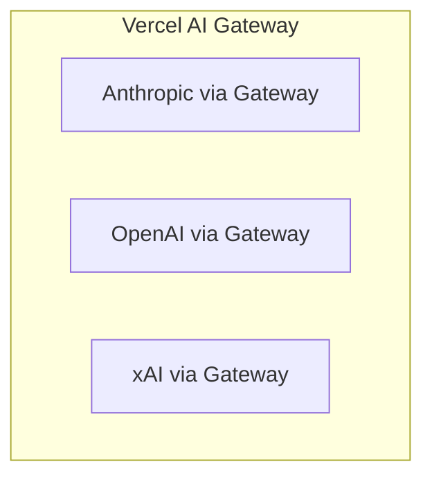

### Claude CLI Integration

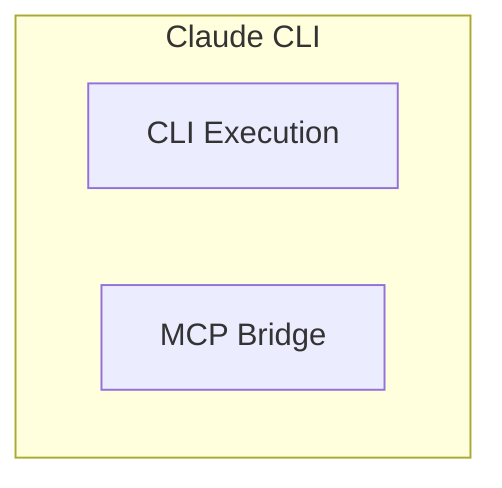

---

## Cross-Service Data Flows

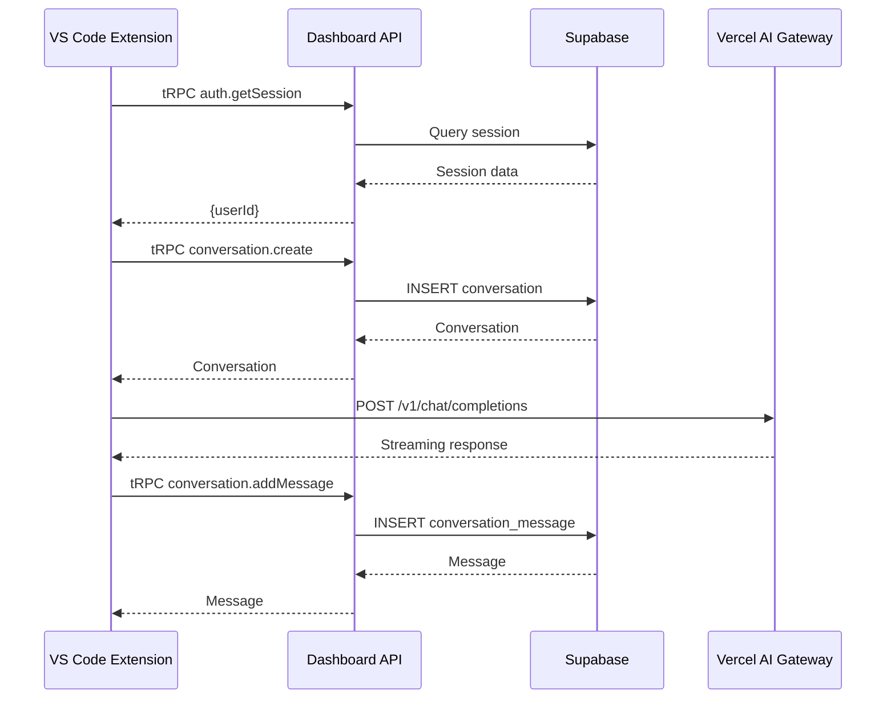

---

## Error Contracts Summary

| Error Type | tRPC Code | When |
|------------|-----------|------|
| ConversationNotFoundError | NOT_FOUND | Conversation ID doesn't exist |
| ConversationError | INTERNAL_SERVER_ERROR | Database/internal errors |
| MessageError | INTERNAL_SERVER_ERROR | Message operations fail |
| RepositoryError | INTERNAL_SERVER_ERROR | Repository operations fail |
| Ownership violation | FORBIDDEN | User accessing another user's resource |

---

## Invariants Summary

| Invariant | Scope | Enforced At |
|-----------|-------|-------------|
| Email uniqueness | User | Database (UNIQUE constraint) |
| User owns conversations | Conversation | API layer (ownership check) |
| Organization membership required | Organization resources | API layer |
| Repository path uniqueness per user | Repository | Application layer |
| File path uniqueness per repository | Files | Database (UNIQUE INDEX) |

---

## Version Information

| Contract Domain | Version | Last Updated |
|-----------------|---------|--------------|
| Database Schema | 1.0.0 | 2026-01-25 |
| tRPC API | 1.0.0 | 2026-01-25 |
| External Integrations | 1.0.0 | 2026-01-25 |
