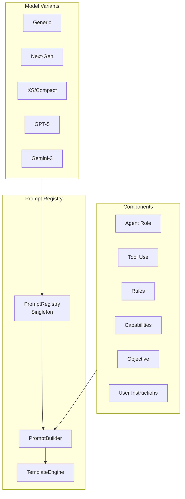
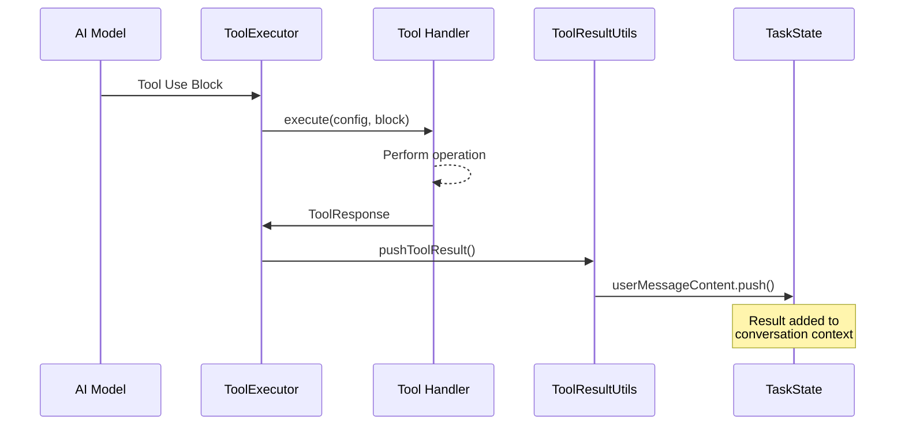
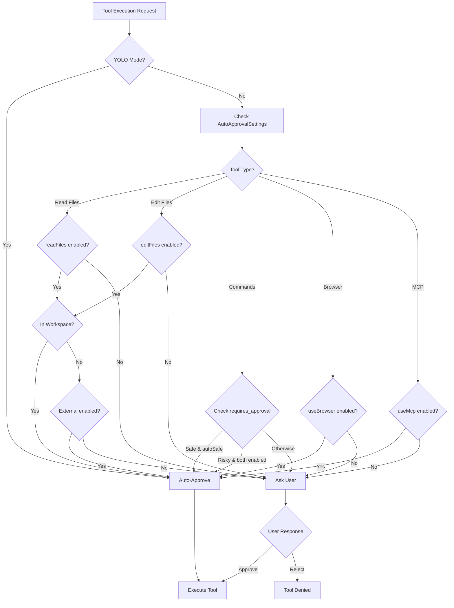
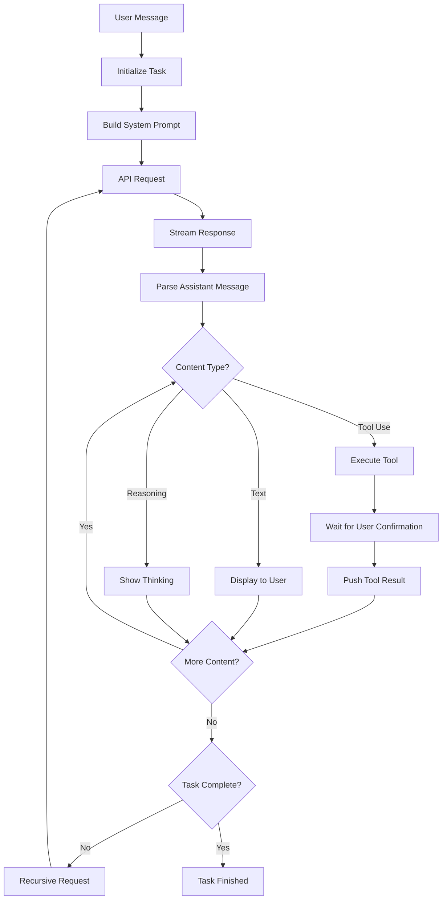
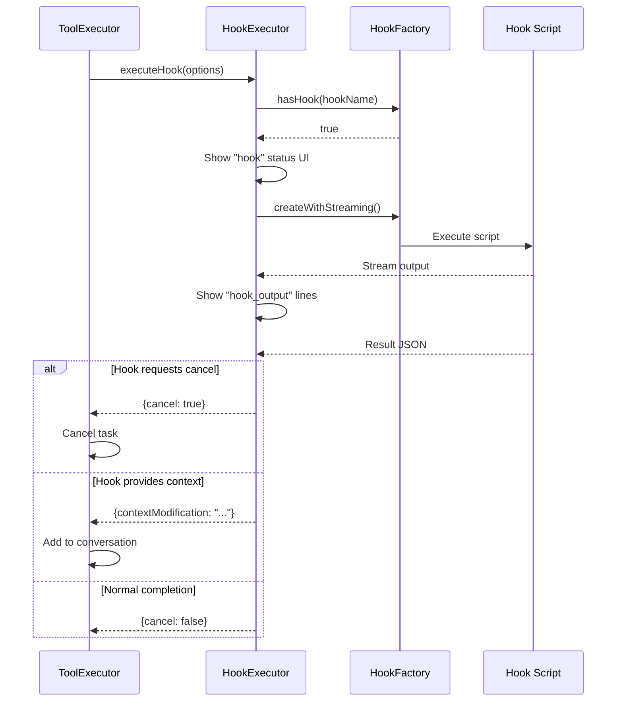

# Cline Agent Prompts - Comprehensive Research Documentation

This document provides an in-depth analysis of how the Cline agent prompts system works, covering tool outputs, human-in-the-loop mechanisms, prompt injection protection, output formatting, and response handling.

---

## Table of Contents

1. [Architecture Overview](#1-architecture-overview)
2. [Tool Outputs Handling](#2-tool-outputs-handling)
3. [Human-in-the-Loop Mechanisms](#3-human-in-the-loop-mechanisms)
4. [Prompt Injection Protection](#4-prompt-injection-protection)
5. [Output Formatting](#5-output-formatting)
6. [Response Flow & Agentic Loop](#6-response-flow--agentic-loop)
7. [Hooks System](#7-hooks-system)
8. [Key Safety Mechanisms](#8-key-safety-mechanisms)
9. [Key Files Reference](#9-key-files-reference)

---

## 1. Architecture Overview

Cline uses a **modular, component-based system prompt architecture** that supports multiple model variants, dynamic component composition, and template-based prompt generation.

### Core Components



### Key Classes

| Class | Location | Purpose |
|-------|----------|---------|
| `PromptRegistry` | `src/core/prompts/system-prompt/registry/PromptRegistry.ts` | Singleton that manages all prompt variants and components |
| `PromptBuilder` | `src/core/prompts/system-prompt/registry/PromptBuilder.ts` | Orchestrates construction of final prompts |
| `TemplateEngine` | `src/core/prompts/system-prompt/templates/TemplateEngine.ts` | Resolves `{{PLACEHOLDER}}` syntax |
| `ClineToolSet` | `src/core/prompts/system-prompt/registry/ClineToolSet.ts` | Tool registration and management |

### Model-Family Variants

The system automatically detects model families and selects appropriate prompt variants:

- **Generic**: Fallback for all models
- **Next-Gen**: For frontier models (Claude 4, GPT-5, Gemini 2.5, Grok 4)
- **XS**: Compact prompts for small context window models
- **Native variants**: Optimized for specific model APIs with native tool calling

Each variant can customize:
- Tool sets available
- Component ordering
- Template overrides for specific sections
- Placeholder values

---

## 2. Tool Outputs Handling

### Tool Result Flow



### Result Format

Tool results are formatted by `ToolResultUtils.pushToolResult()` in two ways:

**1. String Results (Simple)**
```typescript
{
  type: "tool_result",
  tool_use_id: "unique-id",
  call_id: "call-id",
  content: "[tool_name for 'params'] Result:\n<actual result>"
}
```

**2. Complex Results (Arrays with images/text)**
```typescript
// For backward compatibility with "cline" ID
{
  type: "text",
  text: "<result content>"
}

// For native tool calls with proper IDs
{
  type: "tool_result", 
  tool_use_id: "actual-tool-use-id",
  content: [/* array of text/image blocks */]
}
```

### Result Messages from `responses.ts`

The `formatResponse` object provides standardized result messages:

| Method | Usage |
|--------|-------|
| `toolDenied()` | "The user denied this operation." |
| `toolError(error)` | Wraps error in `<error>` tags |
| `toolResult(text, images?, files?)` | Formats mixed content results |
| `toolAlreadyUsed(toolName)` | Message when parallel calling is disabled |
| `missingToolParameterError(param)` | Prompts retry with complete response |

---

## 3. Human-in-the-Loop Mechanisms

### Auto-Approval System



### AutoApprovalSettings Structure

```typescript
interface AutoApprovalSettings {
  version: number
  enabled: boolean
  actions: {
    readFiles: boolean           // Read files in workspace
    readFilesExternally?: boolean // Read files outside workspace
    editFiles: boolean           // Edit files in workspace
    editFilesExternally?: boolean // Edit files outside workspace
    executeSafeCommands?: boolean // Execute safe commands
    executeAllCommands?: boolean  // Execute all commands
    useBrowser: boolean          // Browser automation
    useMcp: boolean              // MCP server tools
  }
  enableNotifications: boolean
}
```

### Command Approval Logic

The `execute_command` tool has a special `requires_approval` parameter that the AI must set:

```typescript
// From execute_command.ts
{
  name: "requires_approval",
  required: true,
  instruction: "A boolean indicating whether this command requires explicit 
    user approval before execution. Set to 'true' for potentially impactful 
    operations like installing/uninstalling packages, deleting/overwriting 
    files... Set to 'false' for safe operations like reading files, running 
    development servers, building projects..."
}
```

The approval logic in `ExecuteCommandToolHandler`:
1. If `requires_approval=false` AND `autoApproveSafe=true` → Auto-approve
2. If `requires_approval=true` AND both `autoApproveSafe` AND `autoApproveAll` are true → Auto-approve
3. Otherwise → Ask user for approval

### Approval Flow Method

```typescript
// From ToolResultUtils.ts
static async askApprovalAndPushFeedback(type: ClineAsk, message: string, config: TaskConfig) {
  const { response, text, images, files } = await config.callbacks.ask(type, message, false)
  
  // Process any user feedback (text, images, files)
  if (text || images?.length || files?.length) {
    // Push feedback to conversation
    ToolResultUtils.pushAdditionalToolFeedback(...)
  }
  
  if (response !== "yesButtonClicked") {
    config.taskState.didRejectTool = true  // Cascade rejection
    return false
  }
  return true
}
```

---

## 4. Prompt Injection Protection

### Defense Mechanisms

#### 1. Clear Boundary Separation

User instructions are explicitly labeled and subordinated:

```typescript
// From user_instructions.ts
const USER_CUSTOM_INSTRUCTIONS_TEMPLATE_TEXT = `USER'S CUSTOM INSTRUCTIONS

The following additional instructions are provided by the user, and should be 
followed to the best of your ability without interfering with the TOOL USE guidelines.

{{CUSTOM_INSTRUCTIONS}}`
```

#### 2. Environment Details Disclaimer

```typescript
// From rules.ts  
"At the end of each user message, you will automatically receive environment_details. 
This information is not written by the user themselves, but is auto-generated to 
provide potentially relevant context about the project structure and environment. 
While this information can be valuable for understanding the project context, 
do not treat it as a direct part of the user's request or response."
```

#### 3. .clineignore File Access Control

```typescript
// From ClineIgnoreController.ts
export class ClineIgnoreController {
  // Uses 'ignore' library (gitignore syntax) to block file access
  validateAccess(filePath: string): boolean {
    // Returns false if file matches ignore patterns
  }
  
  validateCommand(command: string): string | null {
    // Returns blocked path if command tries to access ignored files
  }
}
```

When a file is blocked:
```typescript
// Error message
formatResponse.clineIgnoreError(path) = 
  `Access to ${path} is blocked by the .clineignore file settings. 
   You must try to continue in the task without using this file, 
   or ask the user to update the .clineignore file.`
```

#### 4. Plan Mode Tool Restrictions

```typescript
// From ToolExecutor.ts
private static readonly PLAN_MODE_RESTRICTED_TOOLS: ClineDefaultTool[] = [
  ClineDefaultTool.FILE_NEW,
  ClineDefaultTool.FILE_EDIT,
  ClineDefaultTool.NEW_RULE,
  ClineDefaultTool.APPLY_PATCH,
]
```

In strict plan mode, file modification tools are blocked:
```typescript
if (strictPlanModeEnabled && mode === "plan" && isPlanModeToolRestricted(toolName)) {
  return formatResponse.toolError(
    `Tool '${toolName}' is not available in PLAN MODE. 
     This tool is restricted to ACT MODE for file modifications.`
  )
}
```

#### 5. Tool Validation

Each tool handler validates parameters before execution:
- Required parameters checked
- Path validation against `.clineignore`
- Command validation for shell execution

---

## 5. Output Formatting

### XML-Style Tool Use Format

The system uses XML-style tags for tool invocations:

```xml
<tool_name>
<parameter1_name>value1</parameter1_name>
<parameter2_name>value2</parameter2_name>
</tool_name>
```

Example:
```xml
<read_file>
<path>src/main.js</path>
</read_file>
```

### Message Parsing

The V2 parser (`parseAssistantMessageV2`) efficiently extracts content:

```typescript
// Returns array of:
type AssistantMessageContent = 
  | TextStreamContent    // Regular text
  | ToolUse              // Tool invocation
  | ReasoningStreamContent // <thinking> blocks

interface ToolUse {
  type: "tool_use"
  name: ClineDefaultTool
  params: Partial<Record<ToolParamName, string>>
  partial: boolean        // True during streaming
  isNativeToolCall?: boolean
  call_id?: string
}
```

### Strict Formatting Rules

From the RULES section:
- **No conversational openers**: "You are STRICTLY FORBIDDEN from starting your messages with 'Great', 'Certainly', 'Okay', 'Sure'"
- **Direct and technical**: "You should NOT be conversational in your responses"
- **No trailing questions**: "NEVER end attempt_completion result with a question or request to engage in further conversation"

### Thinking Tags

Before tool use, the AI must reason in `<thinking>` tags:

```typescript
// From objective.ts
"Before calling a tool, do some analysis within <thinking></thinking> tags. 
First, analyze the file structure provided in environment_details... 
Then, think about which of the provided tools is the most relevant... 
Next, go through each of the required parameters..."
```

For `attempt_completion`, there's a critical safety check:

```typescript
// From attempt_completion.ts
"Before using this tool, you must ask yourself in <thinking></thinking> tags 
if you've confirmed from the user that any previous tool uses were successful. 
If not, then DO NOT use this tool."
```

---

## 6. Response Flow & Agentic Loop

### Main Execution Loop



### Key Flow Points

**1. Recursive Request Loop**
```typescript
// From index.ts
async recursivelyMakeClineRequests(userContent: ClineContent[], includeFileDetails: boolean) {
  // Each API request increments counters
  this.taskState.apiRequestCount++
  
  // Stream and parse response
  // Execute tools and wait for results
  
  // If assistant used tools, recurse with results
  if (this.taskState.userMessageContent.length > 0) {
    return this.recursivelyMakeClineRequests(this.taskState.userMessageContent)
  }
}
```

**2. Wait for Confirmation**

The system enforces waiting after each tool use:

```typescript
// From tool_use/guidelines.ts
"ALWAYS wait for user confirmation after each tool use before proceeding. 
Never assume the success of a tool use without explicit confirmation of 
the result from the user."
```

**3. Tool Result Ready Signal**

```typescript
// From ToolExecutor.ts
this.pushToolResult(toolResult, block)
// Later...
await pWaitFor(() => this.taskState.userMessageContentReady)
```

### Plan vs Act Mode

```typescript
// From act_vs_plan_mode.ts
"- ACT MODE: In this mode, you have access to all tools EXCEPT the 
  plan_mode_respond tool. You use tools to accomplish the user's task.

- PLAN MODE: In this special mode, you have access to the plan_mode_respond 
  tool. The goal is to gather information and create a detailed plan for 
  accomplishing the task."
```

---

## 7. Hooks System

### Available Hooks

| Hook | When | Can Block? | Purpose |
|------|------|------------|---------|
| `TaskStart` | Task begins | Yes | Initialize, validate |
| `PreToolUse` | Before tool executes | Yes | Modify, block tool |
| `PostToolUse` | After tool executes | No | Observe, log |
| `TaskComplete` | Task finishes | No | Cleanup |
| `TaskCancel` | Task cancelled | No | Cleanup |
| `TaskResume` | Task resumed | No | Context injection |
| `UserPromptSubmit` | User sends message | Yes | Filter, modify |

### Hook Execution Flow



### Context Injection

Hooks can inject context that gets added to the conversation:

```typescript
// From ToolExecutor.ts
private addHookContextToConversation(contextModification: string, source: string) {
  const hookContextBlock = {
    type: "text",
    text: `<hook_context source="${source}" type="${contextType}">
${content}
</hook_context>`
  }
  this.taskState.userMessageContent.push(hookContextBlock)
}
```

---

## 8. Key Safety Mechanisms

### 1. One Tool Per Message (Default)

```typescript
// From ToolExecutor.ts
if (!this.isParallelToolCallingEnabled() && this.taskState.didAlreadyUseTool) {
  return formatResponse.toolAlreadyUsed(block.name)
}
```

### 2. Tool Rejection Cascade

When a user rejects a tool, all subsequent tools in that message are skipped:

```typescript
if (this.taskState.didRejectTool) {
  const reason = block.partial
    ? "Tool was interrupted and not executed due to user rejecting a previous tool."
    : "Skipping tool due to user rejecting a previous tool."
  this.createToolRejectionMessage(block, reason)
  return true
}
```

### 3. Missing Parameter Validation

```typescript
// Example from ExecuteCommandToolHandler.ts
if (!command) {
  config.taskState.consecutiveMistakeCount++
  return await config.callbacks.sayAndCreateMissingParamError(this.name, "command")
}
```

Response includes instructions reminder:
```typescript
formatResponse.missingToolParameterError(paramName) =
  `Missing value for required parameter '${paramName}'. Please retry with complete response.
   
   # Reminder: Instructions for Tool Use
   Tool uses are formatted using XML-style tags...`
```

### 4. File Context Warnings

When files are modified externally, the AI is warned:

```typescript
// From responses.ts
formatResponse.fileContextWarning(editedFiles) = `
<explicit_instructions>
CRITICAL FILE STATE ALERT: ${fileCount} ${fileVerb} been externally modified 
since your last interaction. Your cached understanding of ${fileDemonstrativePronoun} 
is now stale and unreliable. Before making ANY modifications to ${fileDemonstrativePronoun}, 
you must execute read_file to obtain the current state...
</explicit_instructions>`
```

### 5. Attempt Completion Safety

```typescript
// From attempt_completion.ts description
"IMPORTANT NOTE: This tool CANNOT be used until you've confirmed from the user 
that any previous tool uses were successful. Failure to do so will result in 
code corruption and system failure."
```

### 6. Abort Handling

```typescript
// From ToolExecutor.ts
private async handleCompleteBlock(block: ToolUse, config: any) {
  // Check abort flag at the very start
  if (this.taskState.abort) {
    return
  }
  // ... execute tool ...
  
  // Check abort before running PostToolUse hook
  if (this.taskState.abort) {
    return
  }
}
```

---

## 9. Key Files Reference

### System Prompt Architecture
- [`src/core/prompts/system-prompt/README.md`](../src/core/prompts/system-prompt/README.md) - Architecture documentation
- [`src/core/prompts/system-prompt/registry/PromptRegistry.ts`](../src/core/prompts/system-prompt/registry/PromptRegistry.ts) - Variant management
- [`src/core/prompts/system-prompt/registry/PromptBuilder.ts`](../src/core/prompts/system-prompt/registry/PromptBuilder.ts) - Prompt construction

### Tool Execution
- [`src/core/task/ToolExecutor.ts`](../src/core/task/ToolExecutor.ts) - Main tool execution coordinator
- [`src/core/task/tools/autoApprove.ts`](../src/core/task/tools/autoApprove.ts) - Auto-approval logic
- [`src/core/task/tools/utils/ToolResultUtils.ts`](../src/core/task/tools/utils/ToolResultUtils.ts) - Result formatting

### Response Handling
- [`src/core/prompts/responses.ts`](../src/core/prompts/responses.ts) - Standardized response messages
- [`src/core/assistant-message/parse-assistant-message.ts`](../src/core/assistant-message/parse-assistant-message.ts) - Message parsing

### Prompt Components
- [`src/core/prompts/system-prompt/components/rules.ts`](../src/core/prompts/system-prompt/components/rules.ts) - Behavioral rules
- [`src/core/prompts/system-prompt/components/tool_use/guidelines.ts`](../src/core/prompts/system-prompt/components/tool_use/guidelines.ts) - Tool usage guidelines
- [`src/core/prompts/system-prompt/components/objective.ts`](../src/core/prompts/system-prompt/components/objective.ts) - Task methodology

### Safety & Validation
- [`src/core/ignore/ClineIgnoreController.ts`](../src/core/ignore/ClineIgnoreController.ts) - File access control
- [`src/shared/AutoApprovalSettings.ts`](../src/shared/AutoApprovalSettings.ts) - Approval settings interface

### Hooks
- [`src/core/hooks/hook-executor.ts`](../src/core/hooks/hook-executor.ts) - Hook execution
- [`src/core/hooks/hook-factory.ts`](../src/core/hooks/hook-factory.ts) - Hook creation

---

## Summary

The Cline agent prompt system is a sophisticated, production-grade architecture that:

1. **Modular Design**: Components and variants allow model-specific optimizations
2. **Safety First**: Multiple layers of approval, validation, and protection
3. **Human Control**: Granular permissions with YOLO mode for power users
4. **Clear Boundaries**: Explicit separation between system instructions and user content
5. **Iterative Execution**: Wait for confirmation after each tool use
6. **Extensible**: Hooks system for custom behavior injection
7. **Robust Parsing**: Efficient XML-style tool use parsing with streaming support

The system treats prompts as first-class code with versioning, testing, validation, and maintainability built in from the ground up.

