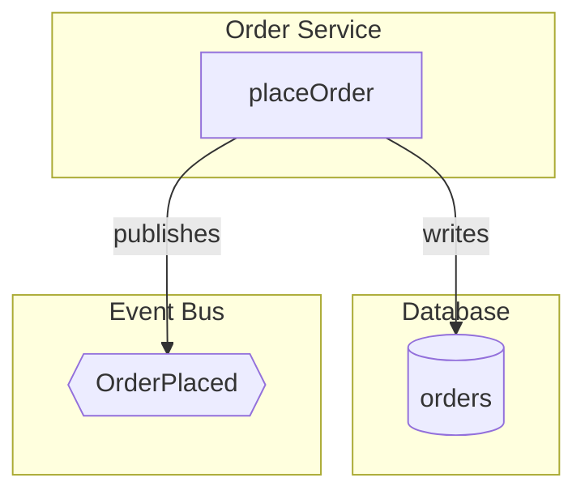
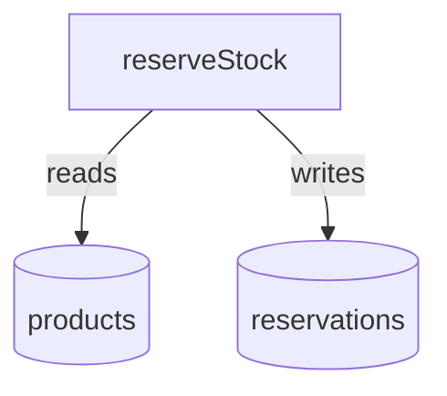

# Sample Contracts

This file contains sample contracts for testing.

## Order Service

```mermaid
graph TB
    subgraph OrderService[Order Service]
        %% @contract Order.place
        %% @location src/orders/place.ts:15
        %% @exposes POST /api/orders
        %% @publishes OrderPlaced
        %% @writes orders
        %% @schema {"input": "PlaceOrderDTO", "output": "Order"}
        %% @invariant order total must be positive
        %% @error InvalidOrder, OutOfStock
        placeOrder[placeOrder]
    end

    subgraph Database[Database]
        %% @contract DB.orders
        %% @location src/db/schema.ts:10
        %% @schema {"table": "orders", "pk": "id"}
        orders[(orders)]
    end

    subgraph Events[Event Bus]
        %% @contract Events.OrderPlaced
        %% @queue order-events
        %% @schema {"orderId": "string", "items": "OrderItem[]", "userId": "string"}
        OrderPlaced{{OrderPlaced}}
    end

    placeOrder -->|"writes"| orders
    placeOrder -->|"publishes"| OrderPlaced
```

## Inventory Service

```mermaid
graph TB
    %% @contract Inventory.reserve
    %% @location src/inventory/reserve.ts:8
    %% @consumes OrderPlaced
    %% @reads products
    %% @writes reservations
    %% @invariant cannot reserve more than available stock
    reserveStock[reserveStock]

    %% @contract DB.products
    %% @schema {"table": "products", "pk": "sku"}
    products[(products)]

    %% @contract DB.reservations
    %% @schema {"table": "reservations"}
    reservations[(reservations)]

    reserveStock -->|"reads"| products
    reserveStock -->|"writes"| reservations
```
